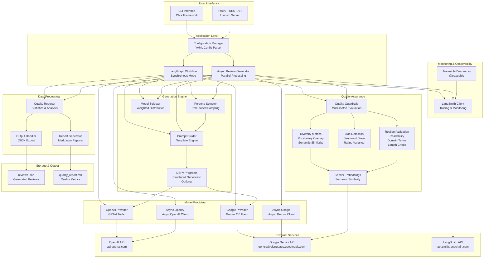
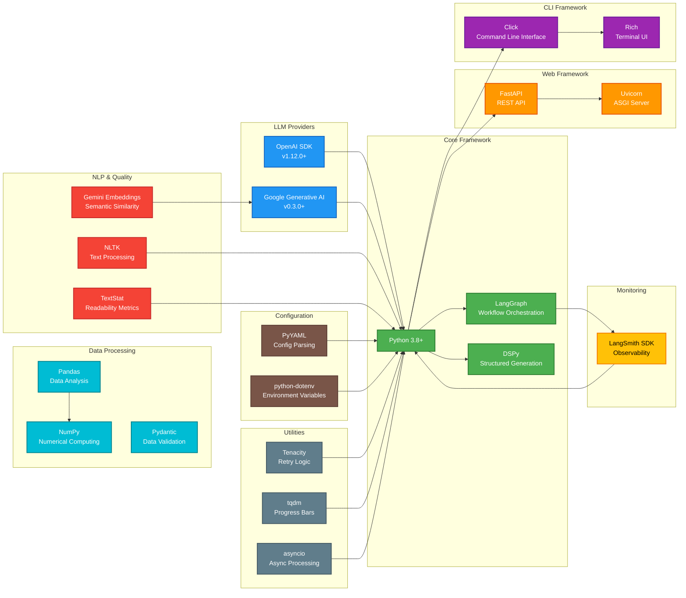
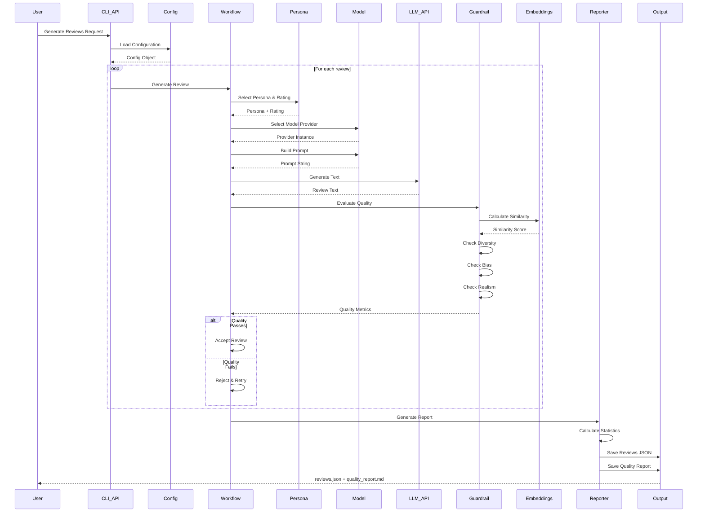
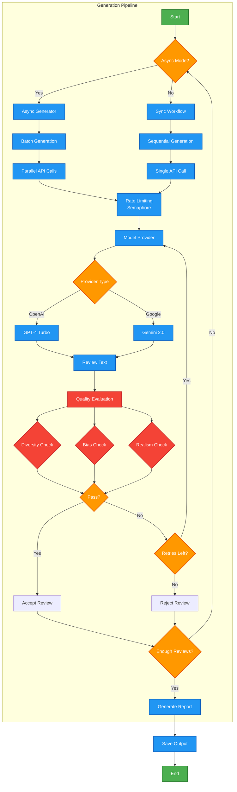
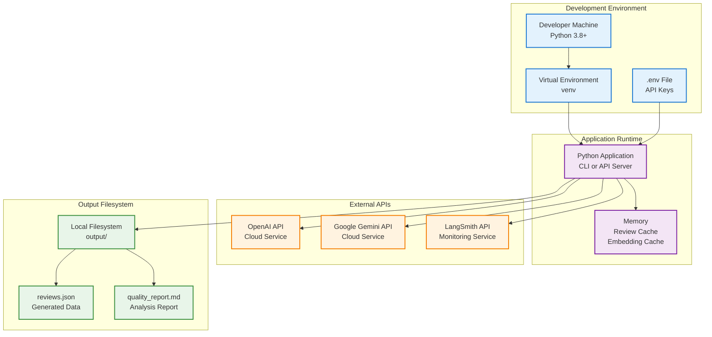

# System Architecture

## Architecture Diagram

## Technology Stack

## Data Flow Diagram

## Component Interaction Diagram

## Deployment Architecture

## Key Design Patterns

1. **Factory Pattern**: Model provider creation (`create_provider`, `create_async_provider`)
2. **Strategy Pattern**: Multiple model providers with unified interface
3. **Observer Pattern**: LangSmith tracing for monitoring
4. **Template Method**: Workflow orchestration in LangGraph
5. **Decorator Pattern**: `@traceable` for observability
6. **Retry Pattern**: Tenacity for resilient API calls
7. **Semaphore Pattern**: Rate limiting in async generation

## Performance Characteristics

- **Synchronous Mode**: Sequential generation, ~1-2 reviews/second
- **Async Mode**: Parallel batch processing, ~10-20 reviews/second (batch_size dependent)
- **Quality Checks**: Add ~0.5-1 second per review (embedding calculation)
- **Rate Limiting**: Configurable via semaphore (default: batch_size=10)
- **Caching**: Embedding cache reduces redundant API calls
